

  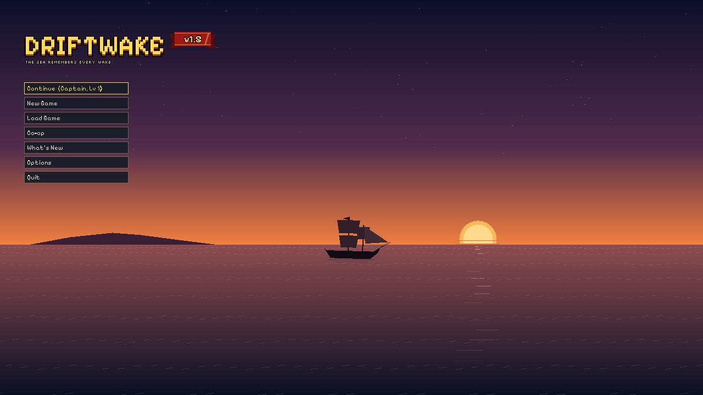

<h1 align="center">Driftwake</h1>

<i>The sea remembers every wake.</i>

  
  
  
  

  A pirate action RPG with a PlayStation 1 look. Sail a living ocean, fight with blades, guns 
  and Haki, and make a name for yourself with up to three friends.

---

## About the game

You're a new pirate captain on Brinehollow, a sleepy fishing island at the edge of dangerous
waters. Make a captain, pick up a cutlass and earn your way off the island. Then take your
sloop out to sea, where pirate fleets, Marines, reefs, whirlpools, storms and something
very large in the deep are waiting.

Driftwake is inspired by shonen pirate adventures. Combat is fast and readable, and you build
a fighting style from your weapons, a web of skills and Haki.

Nearly everything in the game is themed in a PSX style: the characters, islands, ships,
textures, music and sound effects. It's all rendered like a late-90s console game, with
wobbly vertices, dithered colour and a chunky pixel grid.

## Highlights

<table>
  <tr>
    <td width="50%">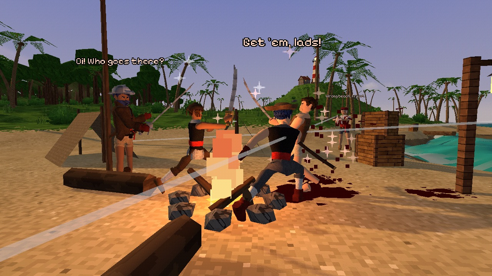 <b>Fight like a shonen hero.</b> Cutlass, katana, axe, pistols and fists, each with its own combo, heavy attack and jump attack. Parry, block, dodge, and break red wind-ups with Haki.</td>
    <td width="50%">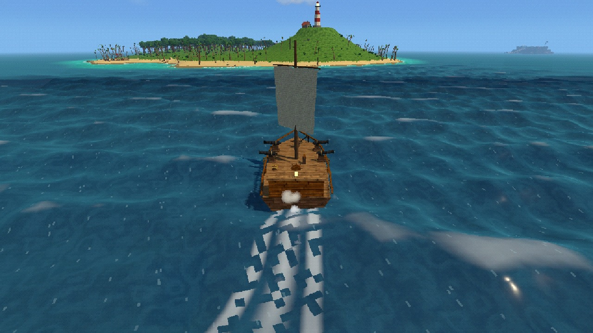 <b>Sail your own ship.</b> Trim the sail to the wind, man the cannons, drop anchor at the capstan, and patch, pump and douse when the hull takes hits.</td>
  </tr>
  <tr>
    <td>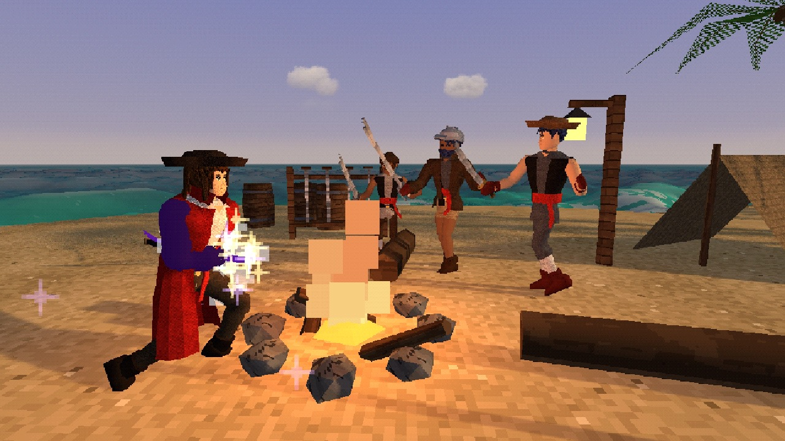 <b>Armament Haki and the iai draw.</b> Coat your arm and blade in Haki, then hold the katana in its scabbard to charge a single dashing cut.</td>
    <td>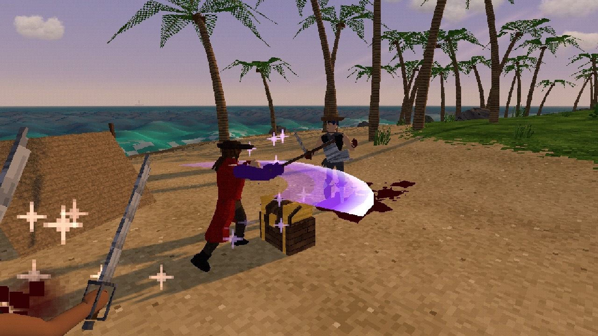 <b>The axe's whirlwind.</b> Right click spins the axe around you, catching everyone in reach and knocking them flat on the second turn.</td>
  </tr>
  <tr>
    <td>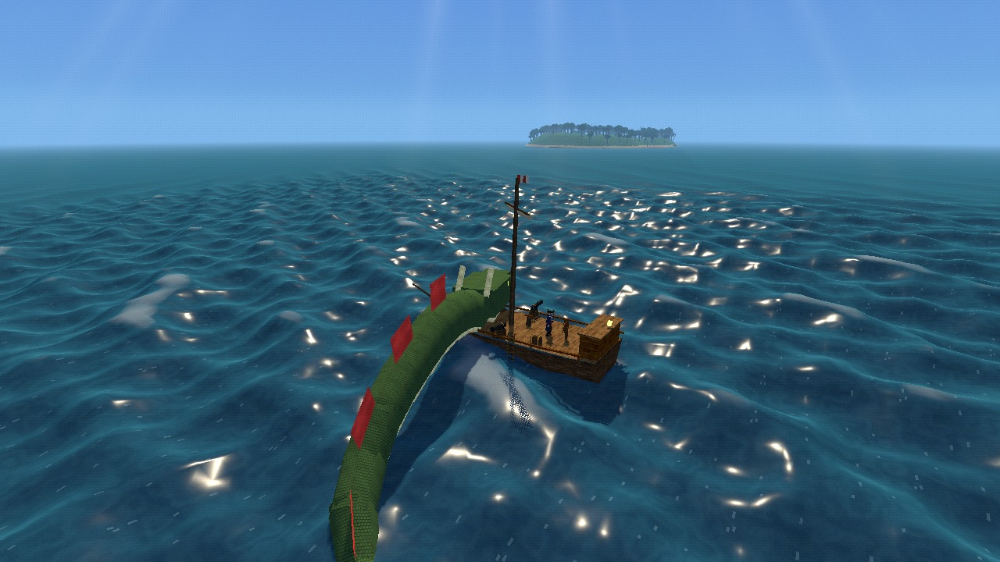 <b>Face the Sea King.</b> A serpent lurks in deep water. Jump its tail slam, cut at its head when it bites the deck, and claim its hoard.</td>
    <td>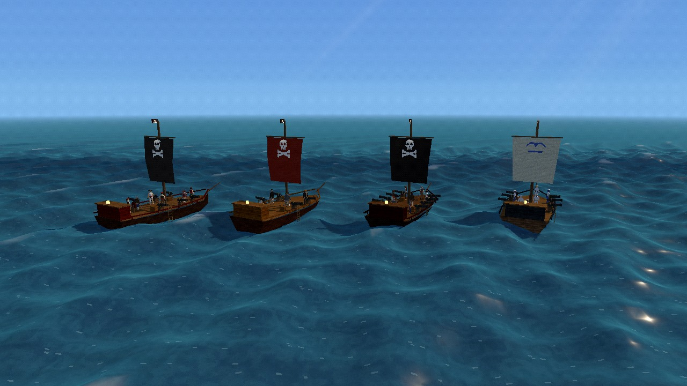 <b>Pirate fleets and Marines</b> that hunt you, fire broadsides, ram, flee and strike their colours. Board them and take their prize.</td>
  </tr>
  <tr>
    <td>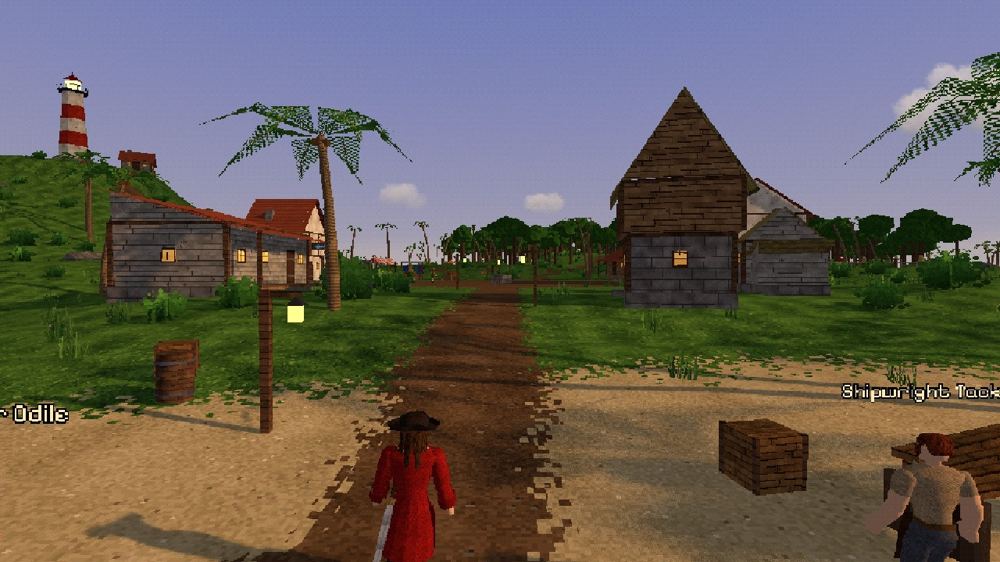 <b>Brinehollow,</b> the starter island: a fishing village, a lighthouse, jungle ruins, a smugglers' camp and traders who buy and sell.</td>
    <td>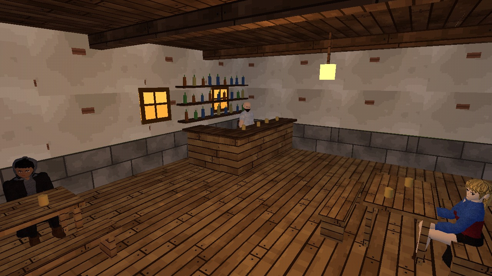 <b>The Salted Gull.</b> Walk into the tavern for rumours, rum and a hot meal from Gus.</td>
  </tr>
  <tr>
    <td>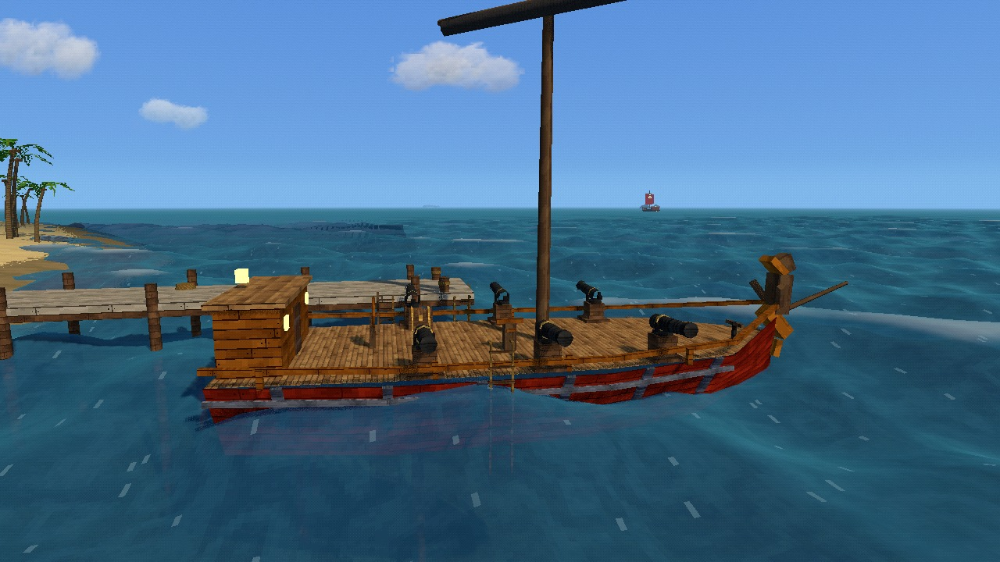 <b>Make the ship yours.</b> Tackett the shipwright refits the hull, guns, sail and rudder, and repaints her with your own flag and figurehead.</td>
    <td>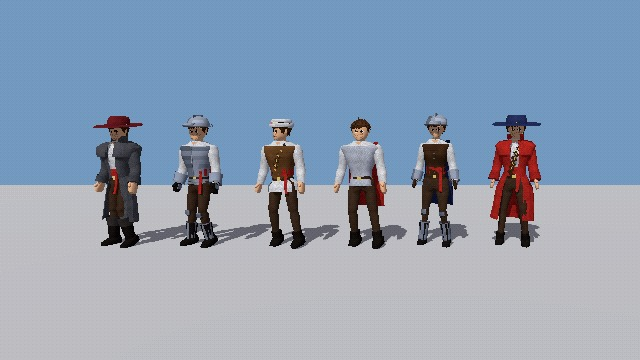 <b>Dress the part.</b> A full character creator, plus hats, coats, capes and armour in seven tiers, from Common to Supreme.</td>
  </tr>
  <tr>
    <td>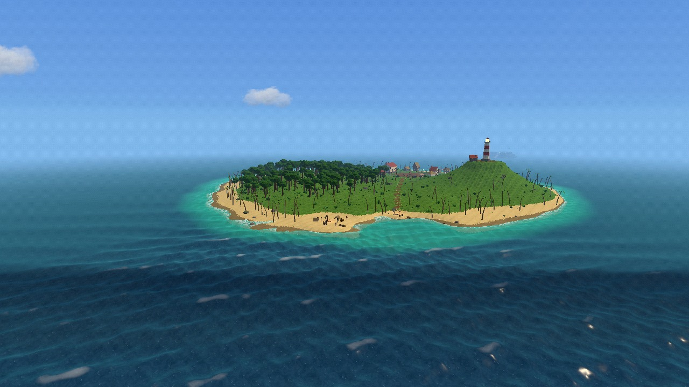 <b>An open sea of islands,</b> with turquoise shallows, wrecks to loot, messages in bottles and treasure to dig up.</td>
    <td>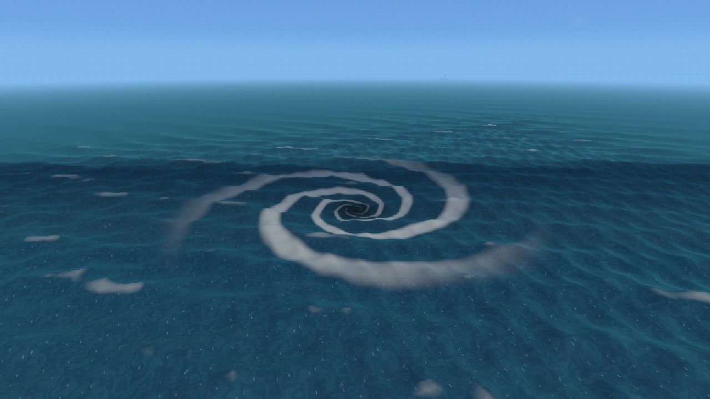 <b>A dangerous ocean:</b> reefs that hole the hull, fog banks, drifting storm cells and whirlpools that drag the sea itself down.</td>
  </tr>
</table>

## Features

### Combat
- **Fighting styles set by what's in your hands:** cutlass, dual swords, katana (two-handed,
  with a charged iai draw), axe (a splitter combo, a whirlwind and the Skybreaker leap),
  pistol, dual pistols (gun kata and Gun Rain), and bare fists (a boxing stance).
- **Parry, block and dodge.** A well-timed parry staggers. Red "peril" attacks can't be
  blocked, only dodged, or broken with Armament Haki.
- **Physics ragdolls, blood and dismemberment.** Heavy hits knock people flying, and a katana
  can cut a cannonball in half.
- **Enemies:** pirate grunts who circle, feint, shoot and raise the alarm; riflemen; scuttlebugs;
  Captain Morrow, a three-phase boss at Redtide Rock; and the Sea King.

### Haki
- **Armament and Observation Haki** awaken at level 10.
- **Armament: Coat** turns your weapon arm and blade glossy black: nothing can block you, and
  every hit breaks red wind-ups.
- **Observation** makes enemy wind-ups flash, widens your parry window, and with Foresight
  dodges the next hit for you.

### The sea
- **Wind and sailing:** points of sail, a braced yard, foam wakes and a swell that rolls the hull.
- **Ship damage:** cannon hits hole the hull, set fires and flood the ship. The crew patch,
  douse and pump to keep her afloat.
- **Hazards and plunder:** reefs, fog banks, whirlpools, storm cells, wrecks, bottles and buried
  treasure.
- **The sea chart (M)** fills in as you explore. Set your own marks to sail by.
- **Your ship:** climb the rigging to the crow's nest, swing from ropes off the yard. Below the
  quarterdeck is the crew cabin, with a bunk to rest in, a galley to restock provisions and the
  crew's shared storage chest. Ashore, hold B and she fades in and sails up to the nearest shore.
- **Death:** you wake in the cabin. Your bag waits on a grave where you fell. Die again before
  you get back to it and the grave sinks into the ground, with everything in it.

### Brinehollow
- Traders who buy and sell: Nessa (treasure), Gus (food and drink), Marlo, Clothier Sela,
  Old Ida, Vey's Armoury, and Tackett the shipwright.
- **Item tiers:** Common, Uncommon, Rare, Epic, Legendary, Ultra and Supreme.
  Better tiers hit harder and guard better.
- 27 weapon designs, plus clothing and armour you can buy or find as plunder.

### Your captain
- A character creator with body, face, hair, hats and outfits. Hair, coats, capes and skirts
  move with physics.
- **Levels and a skill map:** a constellation of skills for mobility, survival, swords,
  guns and Haki.

### World and co-op
- **A day/night cycle and weather:** sun and moon, clear skies, rain, storms with lightning,
  and 3D clouds you can fly through.
- **Co-op for up to four captains,** sharing one ship. Revive downed crewmates, and share
  loot and trades.
- **Saves:** three save slots with autosave.

## Controls

| Action | Key | | Action | Key |
|---|---|---|---|---|
| Move | W A S D | | Inventory | Tab / I |
| Sprint | Shift | | Skill map | K |
| Jump / double jump | Space | | Sea chart (click to mark, C to clear) | M |
| Dodge | Left Ctrl | | Ping a marker | G / middle mouse |
| Light attack | Left click | | Ready / sheathe weapon | Z |
| Heavy attack | Right click | | Pause menu | Esc |
| Parry (tap) / block (hold) | Q | | Zoom camera | Mouse wheel |
| Interact, talk, man a gun (hold for deck jobs) | F | | PSX resolution / dither | F2 / F3 |
| Skills | 1 – 4 | | Fullscreen | F11 / Alt+Enter |
| Quick items | 5 – 7 | | Summon your ship (hold) | B |

**At the helm:** W/S set the sail, A/D steer, left click fires a broadside, and F leaves the wheel.

**Climbing ladders and rigging:** F grabs on, W/S climb, Space jumps off, and F lets go. With a
one-handed blade, Z draws it and left click chops while you hang on.

## Version history

### v1.5: The Open Sea (October 7, 2026)
- **Sailing:** wind and sail trim, an anchor on a chain worked at the capstan, and hulls that
  hole, burn and flood while the crew patches, pumps and douses.
- **Sea hazards:** reefs, fog banks, whirlpools and drifting storm cells.
- **Plunder:** wrecks to loot, messages in bottles and buried treasure.
- **The Sea King:** a serpent at its lair with bites, tail slams and a hoard.
- **Enemy fleets:** sloops, gunboats, brigs and Marines that ram, flee and surrender.
  You can board their ships, and their crews are visible on deck.
- **Navigation:** a sea chart, a compass strip and map marks.
- **Brinehollow's traders and Tackett the shipwright:** refits, paint, a flag designer
  and figureheads.
- **Gear:**
  - Seven item tiers.
  - 27 weapon designs.
  - New armour: cuirass, mail, morion, greatcoat, gauntlets, greaves and capes.
  - Nine more hairstyles, and hats now sit over the hair.
- **New moves:** the axe gets its own moveset, and the cutlass is polished with a running cut.
- **Visuals:** foam wakes, turquoise shallows and rain pooling on deck.
- **Co-op and pacing:** smoother co-op sailing, and levels now take twice the XP.
- **Title screen:** a What's New pop-up and a version ribbon.

### v1.4: Steel and Style (October 6, 2026)
- **The katana:** a two-handed style with a scabbard, a charged iai draw, a running draw
  and an air slash.
- **Pistols:** shots follow the crosshair, dual pistols get the Gun Rain air attack, and gun
  kata works on the move.
- **Blood and dismemberment.**
- **Bodies:** skinned bodies with round knees, elbows and shoulders, and fuller body shapes.
- **Movement:** hip and leg motion, uneven landings, skids and planted stops.
- **Ragdolls:** they no longer slide or vibrate, and they collide with themselves.

### v1.3: Weather (October 5, 2026)
- **Day and night:** a 24-minute day/night cycle with a sky, sun, moon and stars.
- **Weather:** clear, cloudy, rain and storms, with lightning and rough seas.
- **Clouds and light:** 3D puff clouds you can fly through, and god rays.
- **The sea:** waves rebuilt from six wave trains so swimmers and ships ride the waves you see,
  and the sea fades into the horizon.

### v1.2: Pirates (October 5, 2026)
- **Ships at war:** crew-manned cannons and broadsides, plus pirate ships that hunt, fire
  and board.
- **Redtide Rock:** a fort guarded by Captain Morrow, "Red Tide", a three-phase boss.
- **Music** generated for the island, the sea, combat and boss fights.
- **Co-op polish:** pings and crew markers.
- **Inventory:** a loot window, drag-and-drop inventory, and trading between captains.
- **Visuals:** a sharper PSX preset.

### v1.1: Skills and Crew (October 4, 2026)
- **Skills:** a skill bar and energy.
- **Progression:** levels and the skill map, with Armament and Observation Haki.
- **Fighting styles:** sword, dual swords, boxing, pistol and dual pistols.
- **Defence:** blocking, red unblockable attacks, fall damage and foot IK.
- **Saves:** a title screen and three save slots.
- **Co-op for up to four captains:** knocked-out crewmates can be revived, and the crew
  shares one ship.

### v1.0: Brinehollow (October 4, 2026)
- **Brinehollow:** a village, a tavern, a market, a lighthouse, ruins and the smugglers' camp.
- **Characters:** a character creator, procedural anime-style bodies, and hair and cloth physics.
- **Gear and townsfolk:** an inventory, gear, and villagers with branching dialogue.
- **Enemies:** pirate grunts (swordsmen and riflemen) and scuttlebugs.
- **Combat:** parries, ragdolls and the plunge attack.
- **The sea:** the sloop, swimming, and the PSX renderer.

### v0.1: Prototype (April 2026)
- The first prototype, "Grand Line Prototype": procedural islands, an ocean, sword combat,
  a ship and loot banking.

## Coming next

- **Weapon skill trees and mastering abilities:**
  - Every weapon gets its own tree, plus unarmed martial arts.
  - Ability tiers go all the way to automatic: Observation Haki that dodges for you, and a
    shadow-step dodge.
- **New movesets:**
  - sword and pistol;
  - dual wield (sword with a sword, axe or dagger);
  - daggers;
  - dual axes;
  - a two-handed hammer.
- **Bigger ships** with a crow's nest, climbable rigging and ropes to swing from.
- **A new UI:** detailed pixel-art menus and item tooltips.
- **Real lights** on lanterns, windows and torches, and a performance pass.

The working list is in [docs/todo.md](docs/todo.md).

## Running from source

1. Install [Godot 4.7](https://godotengine.org/download) (standard build, not .NET).
2. Clone this repository and open `project.godot` in Godot.
3. Press **F5** to play. The game opens on the title screen.

To play co-op, one captain picks **Co-op → Host** on the title screen and the others
**Join** with the host's IP address (port 24680).

<b>For developers</b>

 

- **Engine:** Godot 4.7 (Forward+, GDScript, Jolt physics, D3D12 on Windows).
- **Generated assets:** textures, sounds and music come from Python scripts in
  `tools/texture_gen/` (`py -m pip install -r tools/texture_gen/requirements.txt`).
- **Tests and render tools:** headless test suites and render tools live in `tools/dev/`,
  and [tools/dev/README.md](tools/dev/README.md) lists each one.
  Run them with `.\tools\dev\run_tests.ps1 <suite>` and `.\tools\dev\nettest.ps1`.
  These screenshots are rendered at the game's "960x540 (sharper)" PSX preset by
  `tools/dev/readmeshot.gd` and the other render tools (with the `psx` argument).
  `tools/dev/readme_media.gd` lists the commands and copies the picks into `docs/media/`.
- **Design notes:** [docs/dev_notes.md](docs/dev_notes.md) has detailed notes from every round
  of work, and [docs/multiplayer_plan.md](docs/multiplayer_plan.md) covers co-op.
- **Exporting:**
  - Add `data/dialogue/*.json` to *Export → Resources → Filters to export non-resource files*,
    or the NPCs will be silent.
  - Exclude `tools/*` and `docs/*`.
- **Debug keys** (editor builds only):

  | Key | Does |
  |---|---|
  | F6 | Cycle the weather |
  | F7 | Skip ahead 2 hours |
  | F9 | Gain a level |
  | F10 | Knock yourself down |
  | F12 | Save a screenshot and a state dump to `tools/dev/out/captures/` |

| Folder | What's in it |
|---|---|
| `scenes/player`, `scripts/player_states` | The player and its state machine |
| `scripts/npc` | Procedural bodies, the animator, the character creator's looks |
| `scripts/combat`, `scripts/enemies` | Hit boxes, ragdolls, grunts, bosses, the Sea King |
| `scripts/powers`, `scripts/progression` | Powers, skills, the skill map |
| `scripts/ship`, `scripts/ocean` | Ships, cannons, enemy fleets, the sea and its waves |
| `scripts/island`, `scripts/world` | Islands, Brinehollow, weather, clouds, sea features |
| `scripts/net` | Co-op networking |
| `scripts/psx`, `shaders/psx` | The PS1 look |
| `scripts/ui`, `scenes/ui` | HUD, menus, inventory, shops, the title screen |

